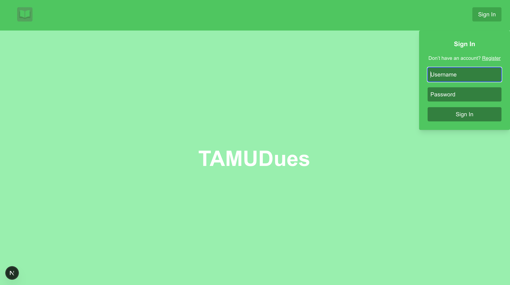
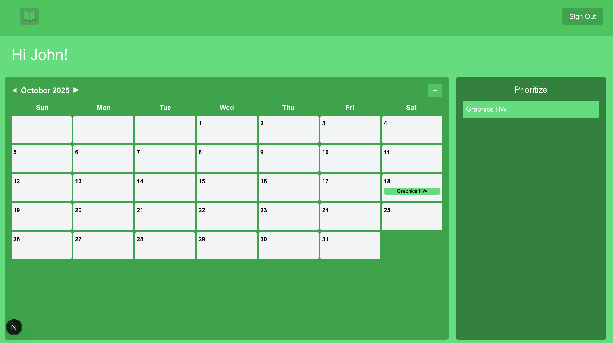
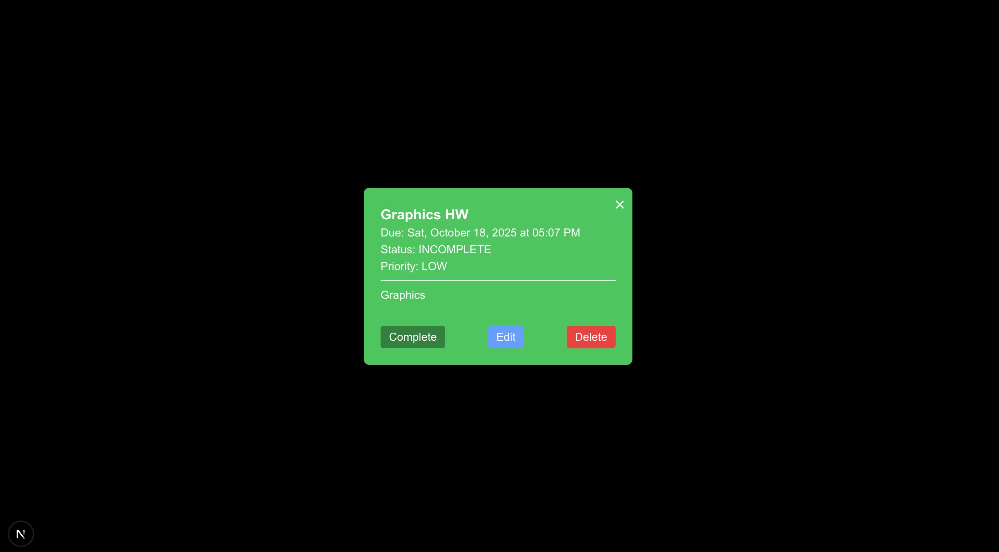
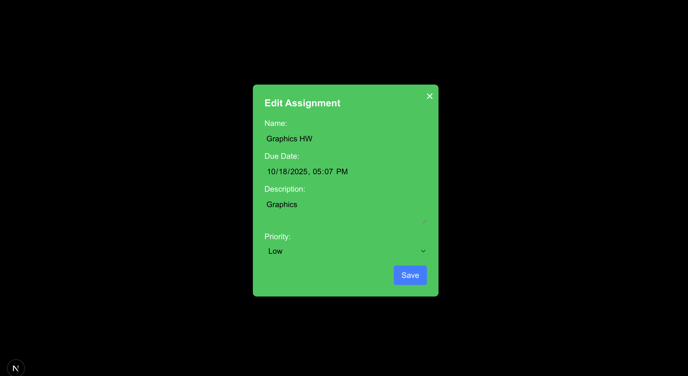

# ⏳ TAMUDues (Currently Under Works)
Allows students to manage due dates between assignments  

# 🎯 Features

- Create accounts
- Add assignments
- Modify assignments
- Find out what to prioritize  

# 📝 Design Choices

Separated Java Spring Backend into multiple layers to avoid sending requests between APIs and reducing repeated code  
Java Spring API is RESTFUL implementing CRUD operations  
JWT Tokens are implemented because they are compact, URL-safe easy to add authentication header and use them to find out what users are logged in + no need to store state on server side
Built Docker Image for Java Microservice to allow for consistent behavior if ever deployed

# 🚀 Inspiration

I simply wanted to learn and work with Java Spring since it's a popular backend framework. Additionally I wanted to practice system design when it comes to
designing scalable systems. Since I needed a project to work with I decided to make a due date tracker since sometimes it's hard to keep track of that during school.
I often like to focus on one task at a time, and I felt this would be a good way for me to do that.  

# 💡 Considerations
- Logic for enforcing unique usernames
- Add Google Authentication so users don't have to memorize a new account credentials
- Get feedback on design
